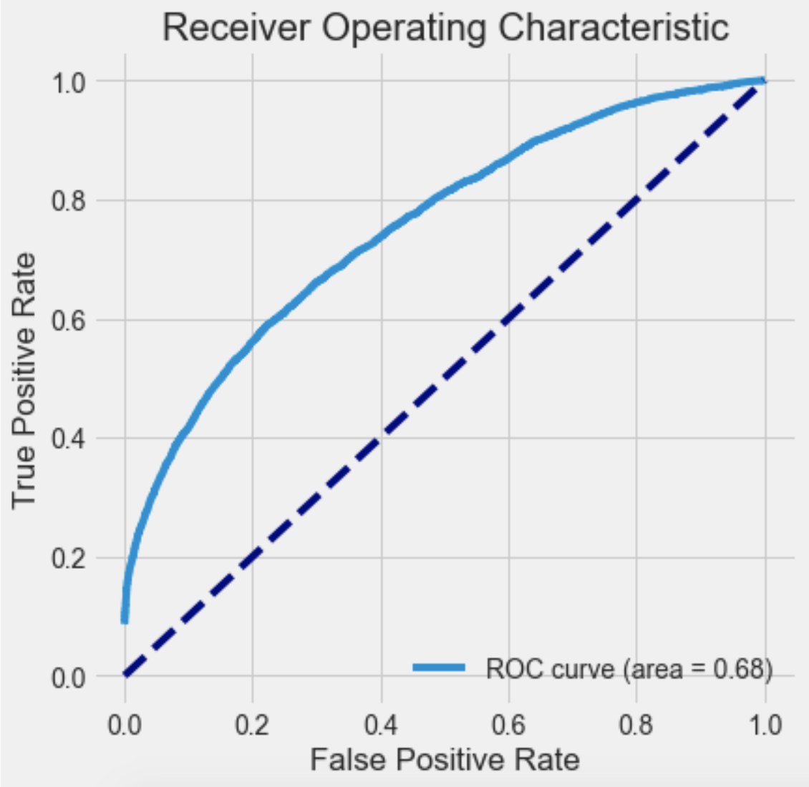

## Lending Club Loan Dataset

Lending Club is the world's largest peer-to-peer lending platform. They make money by charging borrowers an origination fee(1.1-5%) and investors a service fee(1%). 

The dataset can be downloaded [here](https://www.lendingclub.com/info/download-data.action).

## Model

We apply a Logistic Regression to solve the binary classification problem.

### Logistic regression

1. Score function

   First we need to have a **Score Function**: 

$$
t_i = f(x_i)
$$
​	this is the most important part of our work. f(x) is the model/algorithm we will use. It could be as simple as a linear model ($f(x_i) = \beta_0 + \sum_{j=1}^n \beta_jx_{ij}$), or a deep learning model such as a Neuron Network.

2 . Calculate probability

​	No matter what algorithm we use to calculate the score, we will use the **Logistic Function** to scale it in the range of (0, 1) :
$$
\pi_i = Pr(Y=1|x_i)=  \frac{e^{t_i}}{1 + e^{t_i}} = \frac{1}{1 + e^{-t_i}}
$$
​	The plot of the logistic function is as follow:

 

3. Classification

- if the probability $\pi_i >= threshold$ , we classify it as label 1
- if the probability $\pi_i < threshold$ , we classify it as label 0

## Results

Results are of trainned model with L2 regularization & strength of C=1000. (selected using grid search).

**Confusion Matrix**

|             | Ture 0 | True 1 |
| :---------: | :----: | :----: |
| Predicted 0 | 22916  |  6731  |
| Predicted 1 | 12184  | 17688  |

**Statistics**

|           | Precision | Recall | F1-score | n_samples |
| :-------: | :-------: | :----: | :------: | :-------: |
|     0     |   0.65    |  0.77  |   0.71   |   29647   |
|     1     |   0.72    |  0.59  |   0.65   |   29872   |
| Avg/total |   0.69    |  0.68  |   0.68   |   59519   |

**ROC Curve**

Area under ROC curve: 0.68